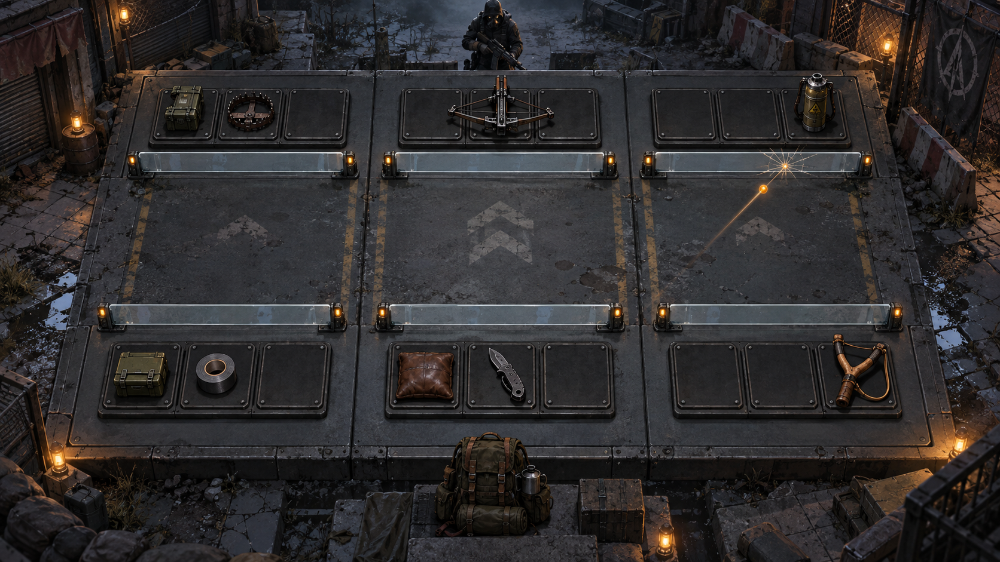

# F9 战斗模块 3D 美术设计方案 v1

状态：**研究与提案，待确认；未实装、未发布。** 基线：`b048e28`。调研日期：2026-09-21。

## 1. 推荐方向与体验目标

推荐采用 **“异常空间中的立体装备台”**：遭遇现场保留真实空间与对手存在感，进入战斗后升到稳定的高位俯视镜头。敌方在远端，我方在近端；装备固定在有明确占格的浅底座上，自行拉弦、蓄能、发射、修复。三路屏障是场上最醒目的受击对象，宿主是最终攻击目标。

玩家首先看懂“谁在什么路、快要发动什么”，接着看见自己的搭配确实发生作用，最后从破路、宿主受创和夺取战利品中获得反馈。3D 的价值是让装备具有可记忆的形体和动作，让因果关系更直观，而不是增加操作负担。

**世界观处理建议**：装备台是遭遇进入战术视图后的表现抽象，不新增“所有敌人都会坐下来陪你玩桌游”的设定。检查站可以是旧金属台，室内可以结合地砖与设备平台；其战斗坐标始终一致。需要用户确认这一表现抽象后，再制作完整场景。



图为本轮使用内置 imagegen 生成的**氛围与体积概念**，不是游戏截图或最终布局规格。检查后保留其双排装备、三路与低屏障构图。正式版本需要：减少中央空地占比；压低外围细碎纹理；增加清晰的冷却与生命 HUD；只摆放实际阵容物件。图中的杂物、额外装备、远端人物造型不构成新增卡牌或敌人设计。模型应比此图更概括，避免照搬其写实制作成本。

## 2. 现状核对：哪些能够继承

| 已核对事实 | 设计含义 | 依据 |
| --- | --- | --- |
| 自动战斗；物件不移动、不被击毁 | 武器动作在底座范围内完成，不能表现成会移动、会挡弹的小兵 | `lib/demo-combat.ts`、现有规则文档 |
| 每方最多9格，左中右各3个横向连续格；1/2/3格固定尺寸 | 三路必须并排；不能为了透视改为九宫格，也不能用模型大小改变占格 | `lib/demo-cards.ts`、当前布阵界面 |
| 每方一名宿主、三道屏障；屏障破损不能重建；溢出伤害进入宿主 | 每方只放一个宿主身份锚点，屏障破损必须留下持续痕迹 | 战斗引擎及回放状态 |
| 即时命中与弹道命中已经区分 | 刀用即时斩击；弹弓使用可追踪飞行物。动画不得人为延迟结算 | `flightTimeOf` 与命中事件 |
| 背包可在战斗中打开，整理只影响后续战斗 | 当前场景继续使用开场快照；不能表现成当前武器被换走 | 当前新手流程与快照约束 |
| 已有 Three.js 场景、CSS3D 文字、镜头切换及连续回放 | 可以复用渲染与事件适配经验，无需再写一套战斗逻辑 | `app/art/room-battle.tsx`、`app/art/playback.ts` |

读取了美术迭代记录、`docs/ART_DIRECTION_2026-09-13.md`、`docs/art-lux3d.md`，并实际打开本地 `/art/?mode=3d` 查看画面。当前原型中房间、人物、桌面和卡牌厚度已成立，但主体仍是图片卡面，窄画面文字明显偏小；布局、装备身份和冒险接入仍需按当前规则重新设计。源码中的流派演示对局、卡图映射以及屏障高度常量也不能直接作为冒险成品使用。

这些证据支持“可以做”，**不代表最终美术已经选定，也不代表性能、拖放和玩家理解已经通过验收**。另一会话正在制作的鉴定台资产未修改。

## 3. 案例调研与取舍

以下案例事实来自官方或开发者资料；“适用于 F9”一栏是本轮设计判断，不是原作者结论。

| 案例及一手资料 | 研究重点 | 适用于 F9 的部分 | 不直接移植的部分 |
| --- | --- | --- | --- |
| [Inscryption：作者 Daniel Mullins 的介绍](https://blog.playstation.com/?p=366772) | 卡牌、对手和可探索空间形成完整氛围；桌面对局与房间探索相连 | 遭遇时先感受对手存在，进入战术状态后集中看装备；实体触感与奖励仪式 | 木屋、献祭、天平，以及所有遭遇都成为对坐牌局的叙事 |
| [Demeo：Resolution Games](https://www.resolutiongames.com/demeo) | 官方定位为重现围桌共同冒险的数字桌面体验 | 用微缩模型与底座建立空间和收藏感；物件轮廓先于细碎纹理 | 角色移动、地形遮挡、自由查看全景带来的额外控制负担 |
| [TFT：Bringing the Festival to Life](https://teamfighttactics.leagueoflegends.com/en-us/news/dev/bringing-the-festival-to-life/) | 开发团队讲述环境从概念到3D、互动特效与音乐的制作 | 固定战斗骨架容纳不同场景主题；环境在关键节点响应 | 将装饰动画和战斗效果放在同等显著的位置；直接套用英雄小队 |
| [Pacific Drive：Ironwood 官方介绍](https://blog.playstation.com/2022/09/13/pacific-drive-welcomes-you-to-the-olympic-exclusion-zone/) | 搜索、维护、升级与安全车库的往返关系 | 把搜到的日常工具做成可信、可修补、有使用痕迹的物体；危险空间与归返形成反差 | 汽车玩法、美国地域与组织设定；全楼层统一成工厂 |
| [Riot：Clarity in League](https://www.leagueoflegends.com/en-gb/news/dev/clarity-in-league/) | 清晰度、视觉层级、减少噪声；效果显著程度对应重要性 | 轮廓识别、方向明确的弹道、重要伤害优先于装饰；光效不能暗示未发生的机制 | 为了“酷”给普通攻击持续全屏震动、强闪光或大量拖尾 |

### 三种候选方案比较

| 方向 | 长处 | 对当前玩法的主要代价 | 本轮结论 |
| --- | --- | --- | --- |
| 全程第一人称对坐桌面 | 氛围强，对手有压迫感 | 远端缩小、手和高模型遮挡；不同楼层都坐桌边难以解释；三路和多格卡不易辨认 | 只借用短暂遭遇镜头 |
| 自由镜头的微缩战场 | 动作空间大，戏剧性强 | 容易误导玩家以为存在移动、阻挡、朝向与距离规则；镜头操作抢走构筑注意力 | 不选为主模式 |
| 固定高位视角的立体装备台 | 布阵、预览、战斗共享坐标；器械动作和格子规则一致 | 需要优秀物件模型与动作，否则仍像平面卡牌加厚 | **推荐** |

比较是设计评估，未用虚构评分或玩家实验包装成定量结论。

## 4. 场景空间与物件摆放

### 4.1 战斗平面：两排装备，三列路线

```text
                      敌方宿主 / 身份与生命

        左路                  中路                  右路
   [ 0 ][ 1 ][ 2 ]      [ 3 ][ 4 ][ 5 ]      [ 6 ][ 7 ][ 8 ]  敌装备
   ━━━敌左屏障━━━       ━━━敌中屏障━━━       ━━━敌右屏障━━━

           ↑↓                   ↑↓                   ↑↓
                    中央攻击表现区域

   ━━━我左屏障━━━       ━━━我中屏障━━━       ━━━我右屏障━━━
   [ 0 ][ 1 ][ 2 ]      [ 3 ][ 4 ][ 5 ]      [ 6 ][ 7 ][ 8 ]  我装备

                      我方宿主 / 身份与生命
```

这是坐标示意，不是屏幕文字要求。双方的“左路”始终对应屏幕左列；敌方模型可以面向我方，但不反转其槽位编号。三格是**沿横向排列**，不是纵深里的前中后排。

- 每个物件由“可读占格底座 + 真正立体的装备模型”组成。两格弩占两格连续底座；一格垫子不会因造型丰厚而伸到邻格。
- 模型运动限制在本底座及其上方的小范围内。伸缩、发射和颤动可以越过轮廓少量，但不能遮住相邻对象的关键标记。
- 锁定格使用关闭的插槽盖和锁形标记；合法空格保持干净。初始解锁进度不因3D改变。
- 三道屏障放在装备排朝向中央的一侧，采用低矮边轨与薄透明防护面。高度上限以不遮挡邻排装备身份为准；数值比例读取真实最大值，不能写死。
- 宿主模型或身份装置位于各自后方中央，生命条固定在屏幕上、下沿。视觉形象只表达现有宿主身份，不接入英雄被动系统。
- 环境只占外围和背景。战斗区内不摆“像可交互物件”的纯装饰，避免玩家误认成卡牌。

### 4.2 空间比例（灰盒起始值，非已验证规格）

单格宽1单位；每路宽3单位，路间留0.25单位；装备排深1.1单位；中央走廊深约1.6单位。主战斗面宽约9.5单位。先保证满阵18个一格物件仍能分辨，再添加外围场景。

概念图中央过宽，实装时应缩短：弹道可以在短空间内按真实飞行时间运动，不能为了放大场景而让卡牌缩小。空白区用于看清攻击方向，不应成为画面主体。

### 4.3 场景主题策略

第一套做“旧街检查站”：搪瓷台面、封锁卷帘、雨痕地砖、少量异常灯光。电梯来路可作为边缘轮廓保留归返方向感。后续只替换环境外壳、材质和少量声音，保持三路位置与照明层级稳定。医院、植物侵蚀等主题只能在对应楼层设定确认后制作，不在本提案中重新分配楼层。

## 5. 镜头设计

| 状态 | 推荐镜头 | 玩家看到什么 |
| --- | --- | --- |
| 首次遭遇 | 短暂较低视点，展示对手及装备台；可跳过 | “我遇到了谁、在哪里” |
| 查看敌阵 / 布阵 | 固定高位正交视角；初始测试仰角约68°，相对水平面计 | 两排同尺度，左中右不变，全部合法格可見 |
| 自动战斗 | 保持同一战术镜头 | 装备动作、屏障受击、宿主变化 |
| 查看物件 | 镜头不动；独立详情卡或模型检视窗 | 不失去三路上下文 |
| 胜利 | 结算成立后短促靠近对手或战利品，再切奖励展示 | 击败敌人并带走装备的满足感 |

采用正交主镜头，是为了敌我尺寸一致和拖放可预测。3D体积来自模型、材质、光影及局部运动，不依赖强透视。灰盒阶段可以与小视角透视镜头对照，但不用自由环绕作为默认操作。

遭遇到战术镜头的过渡暂定总计不超过2秒；首次可稍完整，重复战斗可直接进入战术视角。投影切换需要匹配画面中的台面尺寸，避免突然缩放。普通攻击不追镜、不切特写；屏障破裂只用局部冲击与声音。减少动态选项关闭镜头晃动、推近和强闪光。

## 6. 操作、界面与引导

### 战前

沿用左侧卡牌列表、右侧棋盘。拖动卡牌时拾起浅底座与半透明模型，落点吸附到合法连续格，展示完整占格轮廓；非法位显示叉形及短原因。释放后一次校验提交；移出、Esc 或取消均保持原阵容。模型旋转是装饰检视，不是新增朝向规则。

拖动时隐藏 hover 详情。鼠标停留显示轻量详情；点击可固定侧栏。触屏使用“选卡→选格→确认”作为拖放的替代，键盘也应能完成同一路径。不要要求玩家精确点中模型的细小枪管或拉环：射线命中用完整槽位/底座范围。

### 战斗中

只保留必要 HUD：双方宿主生命、六道屏障状态、物件冷却、暂停/速度、背包。卡牌名在悬停或选择时完整显示，常驻只留关键数值与可辨认图形。描述继续复用 `describeCard`，不另写一套3D文案。

悬停不自动暂停；点击固定详情时可暂停，并明确显示“查看中 · 战斗已暂停”，关闭恢复此前状态。背包整理只影响下场，当前3D场景维持开场快照。无需按攻击键、瞄准或为每次触发手动确认。

### 新手引导如何继承

先展示全棋盘→我方宿主→敌方宿主→三路→屏障→冷却→弹道与溢出。节点4的“查看敌阵”打开与实战完全一致的镜头和坐标，再聚焦中路敌武器，随后进入防御卡布阵。高亮使用目标的屏幕投影包围框，说明贴近目标且不盖住相邻路线。不要为3D重新加一套常驻规则文字。

### 桌面与窄窗

首轮重点支持桌面1024px以上。640–1023px采用更接近俯视的镜头、折叠详情侧栏和减少外围环境；必要时卡牌候选区改为抽屉。保留三路全貌，不横向裁掉某一路。正文以16px为起点，不通过整体缩小文字塞入3D空间。640px以下触屏布局另做专项验证，不能未经验证宣称完整手机支持。

## 7. 卡牌实体化与美术语言

方向是“修补过的日常装备 + 克制的异常反应”。表面主要用旧搪瓷、哑光金属、橡胶、皮革、玻璃；大块色面和轮廓优先，污损集中在接触边缘。保留项目暗绿、炭黑、暖黄的基调；环境低饱和，状态与奖励才使用明亮色。

| 物件族 | 主要形体与动作 | 战斗中的识别意义 |
| --- | --- | --- |
| 弹弓 | Y形轮廓、拉伸皮筋、弹丸释放 | 明确看到发射与稍后命中的区别 |
| 猎隙刃 | 折叠刀体、短促展开与同路目标上的斩痕 | 即时命中，不飞过去、不留在敌阵 |
| 钉枪 / 卷簧弩 | 枪口后坐 / 弓臂绷紧；保留各自大轮廓 | 大型输出件和启动爆发的差别 |
| 缓冲垫 | 皮质或橡胶叠层，减伤时短暂压缩 | 承受冲击后回弹，避免表现成攻击武器 |
| 反冲板 | 弹簧板、逐级蓄力指示，释放时回弹 | 受到实际伤害后积累，再兑现输出 |
| 补漏胶 | 罐体加喷嘴，维修束指向实际屏障 | 修复去向可追踪；不能重建已破屏障 |
| 引信线 | 线轴或继电器，短脉冲连到实际受益物件 | 充能属于具体对象，不是全队泛光 |
| 酸性 / 培养 / 蒸馏等族 | 各自容器剪影、可见液体或内部生长 | 保留族身份，以液位、内部运动区分状态 |

现有卡库包含命名变种，不建议为全部85项从零制作模型。按13个基础物件族建立主模型，再用小型附件、材质和局部形态区分变种；关键机制不同的变种增加可辨认部件。稀有度颜色放在底座铭牌、细边与奖励揭晓中，战斗期间不让传说物件持续喷光。稀有度、品阶、等级保持各自含义，不能用一种颜色同时表达三者。

模型交付必须包含：统一尺度、底座原点、发射点、受益效果锚点、1/2/3格边界、待机/启动/发动动作、简单点击体。武器模型即使朝向敌方旋转，名字与冷却仍朝向屏幕。

## 8. 战斗反馈：把因果做成动作

所有反馈以实际事件为准；下面的颜色和动作是提案。

| 机制 | 表现 | 必须避免的误导 |
| --- | --- | --- |
| 冷却 | 底座刻度逐步亮起，发动前短促机械预备动作 | 预备动作不能代表额外充能，也不能改变发动时间 |
| 弹道攻击 | 发射动作→短尾迹→目标屏障或宿主命中；轨迹与事件时间同步 | 弹丸穿过物件附近不能产生“打坏卡牌”的反馈 |
| 即时攻击 | 源武器动作与目标斩痕在同一个结算时刻发生 | 不加一段虚假的飞行等待 |
| 屏障吸收 | 受击位置短亮、屏障厚度/刻度下降，小碎片朝外 | 不遮挡整条路线，也不把吸收量记为宿主损伤 |
| 屏障破裂 | 一次鲜明开裂、边轨熄灭，留下缺口 | 下一帧恢复完好模型，或维修动画把破路封回去 |
| 溢出与直击宿主 | 同次命中时宿主生命同步变化；短方向提示汇向唯一宿主 | 不再飞行一段才扣血，不制造三条宿主生命 |
| 修复 | 从来源物件到真实目标的短维修光束与实际增加值 | 满屏障或无合法目标时播放“修好很多”的庆祝 |
| 充能 | 定向脉冲命中真实受益卡，其冷却刻度跳进；需要时显示生效量 | 不把充能秒数叫作缩短战斗时间；无收益不显示正收益 |
| 持续腐蚀 | 目标表面保留简洁蚀纹，真实跳伤时短脉冲 | 伤害未发生却不断跳数字；遮住生命与路线 |
| 反击 / 储能 | 计量器按实际存储量增长，发动时释放 | 仅因受击动画就蓄满，与真实伤害脱节 |

视觉与声音优先级：**胜负 / 宿主重击 > 破路 > 有效协同 > 常规攻击 > 待机与环境**。同时发生多次事件时保留结算，只合并低优先级飘字和声音。敌我依靠位置、图形和颜色共同区分，不能仅依赖红绿色差。

声音采用短机械音色：弦响、刀簧、钉枪脆响、屏障裂响、维修黏合声。左右声像辅助路线定位，但单声道或静音时信息仍完整。没有实际命中，不播放命中音。

## 9. 一场战斗的完整演出

1. **看见敌人**：场景与对手短暂出现；高位镜头展开真实敌阵。敌阵、开场和回放用同一份数据。
2. **做好准备**：玩家把缓冲垫拖到中路，底座吸附、轻微落台声确认；变化立即体现在布局中。
3. **开始**：开战按钮后短提示，物件开始计时，镜头不再移动。首次教学按当前事件暂停，动画与声音同时停住。
4. **观察**：弹弓拉弦后弹丸飞行；中路垫子减伤时压缩。某路屏障碎裂时有清晰的一次声画强调；溢出直接同步影响宿主生命。
5. **胜利**：敌方宿主失去战斗状态，环境声音短暂收束，显示“胜利”。先让结果成立，再让演出收尾；不新增扣血或改变结束时刻。
6. **带走装备**：战利品界面展示实际抽中的敌方武器模型，抬起、转向玩家、揭示名称与稀有度，玩家点击领取；随机结果只确定一次。普通战斗也要有完整领取动作，BOSS用更强的既有宝箱演出。
7. **判断计划**：默认摘要只呈现实际宿主损伤、关键破路、一个有效贡献；详细统计和逐事件记录保持折叠。模型漂亮不能取代战后证据。

## 10. 技术落地边界与制作顺序

继续用现有战斗引擎与 Three.js 能力。渲染层读取对局快照、帧状态和带实例标识的事件，不进行伤害、碰撞或随机掉落计算。来源卡、目标卡与目标路线保持 UID 对应。倒放/重播时重建视觉状态、清理过期音效；暂停时视觉时间不继续走。3D物理只用于不影响结果的碎屑等装饰。

首轮资源预算是**待实测的制作约束**：主流桌面1080p争取60fps，低档降特效争取稳定30fps；战斗场景首包目标8–12MB（压缩后，外围主题按需加载），可见三角形先控制在20万以内，draw call以120以内为起点。优先烘焙环境照明、接触阴影、实例化底座、复用材质，避免18件物品各自使用高分辨率贴图与动态点光源。以上不是现有原型测试成绩。

| 阶段 | 具体交付 | 通过条件 |
| --- | --- | --- |
| ① 空间灰盒 | 两排九格、六屏障、双方宿主、同坐标预览与布阵；对照两种镜头 | 满阵、两格/三格卡和窄窗仍能判断路线与落点 |
| ② 一场垂直切片 | 弹弓、刀、垫子、弩、补漏胶，第一套检查站环境；覆盖命中、减伤、破路、奖励 | 从敌情→布阵→战斗→领取全过程可读，教学暂停正确 |
| ③ 机制覆盖 | 补齐其余物件族、充能/腐蚀/储能表现与命名变种 | 所有主要机制能从真实事件追踪来源和目标 |
| ④ 扩展与性能 | 场景外壳、低画质、无障碍与加载优化 | 目标设备实测后再决定正式替换范围 |

WebGL不可用时保留现有2D战斗作为兼容路径，依然读取相同对局；没有必要为本方案新增框架或全局状态系统。此次只提交方案，不执行上述生产阶段。

## 11. 验收清单与未验证问题

### 规则与表现

- [ ] 同一对局的预览、开场、战斗与回放中，实例、占格、路线完全一致。
- [ ] 屏障吸收、破损、溢出、宿主损伤与事件逐项对应；已破屏障不重建。
- [ ] 即时/弹道区别清楚；1×、2×、暂停、继续、跳结果和重播不多播、不漏播重要命中。
- [ ] 充能、修复、储能的目标及有效量真实；无收益不夸大。
- [ ] 满阵18个物件、长名称、多格卡、锁定格、合法交换与取消都可正常理解和操作。
- [ ] 战斗中背包整理不会改变当前战斗快照，也不会在当前场景偷偷替换模型。

### 视觉与玩家理解（待执行，不是已有成绩）

- [ ] 1024px以上桌面与640px窄窗分别截图检查，文字不用整体缩小。
- [ ] 邀请未接触此版本的玩家指出敌我、三路、主要威胁以及最终攻击目标；记录是否误认为物件会被击毁或阻挡。
- [ ] 玩家能完成一次布阵，战后指出一件装备的真实收益；区分缺少组件与操作失败。
- [ ] 对比正交与轻透视灰盒，在相同布局下观察误判、遮挡和操作，不把小样本时间差当统计结论。
- [ ] 静音、减少动态、色觉差异下仍能辨认主要事件。
- [ ] 按目标硬件记录帧时间、首包、峰值内存；未达到指标先减装饰，不减规则可读性。

**最大的待确认点**是玩家是否接受“遭遇空间转化为立体装备台”的抽象。其次是高位镜头下真实器械能否比卡面更容易识别，以及18物件同时运行时视觉是否拥挤。应先用一个高质量垂直切片回答这三点，再投入全部变种和楼层场景。

## 12. 本轮交付与证据边界

完成：规则/代码/既有美术记录核对；现有本地3D原型视觉检查；五组一手案例研究；方案、空间规格、交互、动作、资产与验收规划；一张原创氛围概念图。

未进行：游戏代码修改、3D生产资产建模、冒险接入、新玩家测试、性能基准测试、生产发布。没有把旧原型或生成图称作已验证的成品。文档变更不需要重新执行游戏测试；后续实装须按仓库要求运行相应测试。

概念图：`docs/art/battle-3d-2026-09-21/equipment-stage-concept.png`。生成方式：内置 imagegen；完整提示词见同目录 `concept-prompt.txt`。
