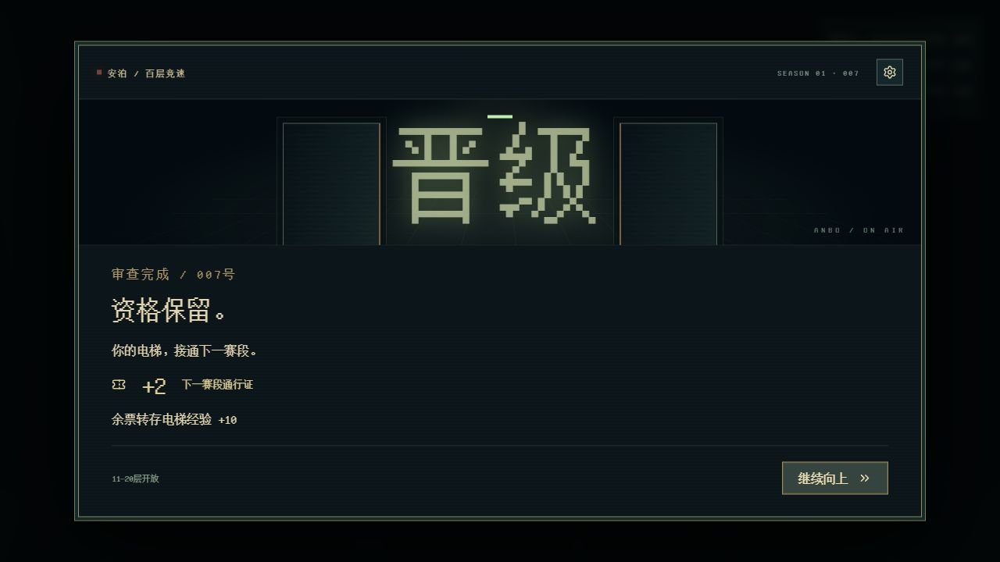

# 百层竞速与通行证：首版设计及实现

日期：2026-10-03。状态：用户授权设计与开发，首版已接入 `/survival`；具体数值由助手选作试玩初值，尚未证明平衡或获得用户体验验收。AI在独立分支，本轮没有模型调用或AI角色控制。

## 玩家实际经历

保留睁眼、荒原、首次开灯、饥渴、二层探索、装备相邻和首次电梯升级的教学。第三层首次返程确认物资后，安泊揭晓节目：你是007号选手，先合法抵达100层者获胜。三段可点击的气泡依次说明目标、单向跨层、十层审查；自动播放默认关闭，介绍期间全体模拟停止。

此后小循环是：进入当前层 → 选择通行终端、补给、装备或脑浆 → 回电梯 → 留在同层准备，或支付通行证选择跨度 → 面对更高层 → 每十层审查。电梯主页同时显示当前楼层、下个审查点、剩余资格时间、票数与升级配方及奖励。

节目包装使用已有精细像素字体、冷铁屏幕、金色票券与暗红直播标记。终端新增赛事Tab，展示公开到达楼层、领先／落后、真实事件记录。晋级时舞台门打开，展示资格保留、余票转存和下一段票；超时注销资格时门下沉变暗；合法抵达100层后展示优胜。真实模拟结果决定演出，台词不创造胜负。

## 首版通行规则

| 机制 | 当前可执行规则 | 设计目的 |
| --- | --- | --- |
| 支付 | 每上升1层支付1张，失败操作不扣票 | 玩家能直接比较准备与冲刺 |
| 同层 | 免费重进，保留迷雾、打开的箱子、终端状态和死亡背包 | 可以补给、追回失物；不能重进刷出整套新资源 |
| 单向 | 不能返回低于最高到达层；跳过楼层永久错过 | 跨越意味着放弃准备机会 |
| 账户 | 登记票有稳定UID，不占普通背包，倒下后保留，上限10张 | 保留重新出发能力，同时限制囤票 |
| 升级 | 居所2／3／4／5的单次跨度为3／5／7／9层 | 长期成长提升路线选择，不额外收取每层升级费 |
| 升级成本 | 脑浆经验40／70／100及机械零件2份；余经验保留 | 使用已有脑浆、零件与升级演出 |
| 有效范围 | 票只在当前赛段有效，审查层晋级后使用下一段票 | 低层票不能一路囤到终点 |
| 必经点 | 10、20……90层不能越过；100层为终点 | 为共同目标、审查与竞争预留节点 |
| 审查 | 本层驻守者死亡，携带2张本段票，在电梯提交 | 战斗成果、资源和返程形成资格闭环 |
| 余票 | 审查消耗2张，其余本段票每张转5电梯经验；发下一段票2张 | 公开清算，不静默作废，也能继续出发 |

票的来源不与普通脑浆掉落混在一起。每层四个通行点：登记箱2张、封存票匣2张、守卫封印3张、应急签发器1张。前三者一次性；应急签发器可重复。前两者操作3秒，守卫封印需击败驻守者后操作3秒；应急签发需8秒，成功后冷却15秒。所有来源共用一份领取／冷却状态，无每人一份的隐藏副本。

玩家必须在1.8米内、未被墙遮挡，按住E并停下移动。受伤、离开、移动或放开E中断登记。票袋不能容纳整份产出时不部分签发、不消耗来源。模型不能直接填写“获得票”；只有执行器观察证明合法操作完成才签发。

3D票券标记带慢呼吸、地面半透明光圈；只在运镜完成且视野可见时显示。小地图只记录探索到的终端。提示显示守卫条件、登记进度、冷却或票袋满，不增加角色头顶照明。

## 时间、晋级与淘汰

首段从第三层参赛开始，到十层审查，暂定12分钟。每次晋级的规则动作重新设置下一段12分钟；晋级演出暂停模拟，确认继续后计时。正常探索、搜刮、出门、返程、救援及电梯中的停留都推进比赛时间。升层不刷新本段时限，停在已审查楼层继续补票也会耗费下一段时间。

设置暂停、浏览器失焦暂停、强引导、物品管理／系统弹窗、规则介绍、审查与结果演出暂停全体模拟；菜单用于思考，不让电脑选手在界面后偷跑。暂停面板保留原生对话框最高层级。未来模型网络等待不得只扣某个选手的游戏时间。

两种失败分开：

- 精神力归零：倒下、黑屏、安泊救回；装备、安全容器和登记票保留，普通行囊留在原地，可同层追回。赛事仍有救援时间成本。
- 资格期限到达仍未通过下一审查，或其他选手先到100层：本季资格注销，进入结果界面。不会用偷偷少发资源来代替公开淘汰。

当前没有末位配额、临时规则、杀人抢已登记票、观众投票或热门值加票。这些属于后续设计，不能用未实现的台词伪装成机制。

## 给AI分支的规则契约

纯规则文件 `lib/survival-race.ts` 与场景适配 `lib/survival-race-session.ts` 分离。公共赛事只有一份种子、模拟tick、选手、来源、工作进度与事件日志。

| 接口 | 意义与约束 |
| --- | --- |
| `registerContestant` | 实际执行器入场后激活选手；当前三名占位选手是“未入场”，不自动赶路 |
| `tickRace(observations)` | 同一次tick提交所有选手的权威移动／受击／视线／工作观察；每帧只能调用一次，共享来源争抢同样判定 |
| `destinationReason / ascendRace` | AI和玩家使用同样的跨度、UID扣票、单向与审查限制；非法行动返回原状态 |
| `transferPasses` | 经双方合法交易后转移真实票UID；禁止重复、超容量、跨错赛段；尚无玩家谈判／交易UI |
| `qualifyRace` | 由实际世界证明驻守者已死亡；审核本层、本段票和期限，不采信模型自述 |
| `events` | 真实入场、领取、转交、抵达、晋级、淘汰与胜者记录，最多保留48条 |

`RaceState` 是权威裁判状态，不能全部直接喂给AI当可见观察。AI分支仍需生成各选手的信息视野、执行真实动作与离屏世界模拟，并汇总所有观察送到同一赛事时钟。本分支的session只生成玩家观察；给其他选手写策略或伪造楼层变化不属于本轮。

此接口支持同点先来者取得票、共同打守卫后分配票、交易后抢先离开等博弈的后果；这些博弈的实际遭遇、意图与谈判，要等AI分支接入才能试玩和评估。

## 地图与兼容

支持三层至100层的路线与胜负框架。四层起复用已验证的维保、中国庭院资产包；奇偶主题交替，庭院有雨夜／宴景／遗迹配色，楼层种子、箱子、物品和驻守者UID各自固定。未来主题通过同一房间生成入口扩展。

这不代表已经制作100套独立关卡。当前空间布局重复，守卫主要数值成长，缺少高层装备梯度与多种审查挑战，后段平衡尚未验证。首轮重点试玩3→10层的取票／成长／冲刺决策。

存储键仍为 `f9-survival-opening-v4`。旧教学使用 `f9-survival/6`；开启赛事后状态7及信封 `f9-survival/7`。读取旧版本时保留世界和物品UID；拒绝产品／信封版本错配、重复票、非法比赛状态。底层房间战斗仍遵守v6回放，原黄金样本未修改。

## 试玩入口与证据

设置 → GM → 搜索“百层竞速”，新增七项：节目揭晓、赛事与电梯主页、通行终端、十层审查、晋级演出、资格注销、百层优胜。GM票与后期状态明确是调试配给，不是正常游戏隐藏补偿。

验证：新增15项赛事测试，覆盖共享争夺、登记中断、冷却UID、满票原子性、转交、跨层扣票、审查不能跳过、下一段计时、先到100层判胜、版本错配、同层状态保留、全部97层模板通行点可达、死亡背包与升级结余。电梯122项、全项目320项通过，原回放保持一致。全库与电梯类型、lint、边界、确定性及依赖检查通过。全项目构建成功，电梯3条、卡牌8条路由完成静态产出；仍有既有框架动态导入及Three.js大包警告，不属于失败。

实机已检查：三段规则气泡点击、赛事未入场状态、三层扣3张进六层、十层提交4张产生10经验及下一段2张、下一目标变20层、资格注销与百层优胜，以及暂停覆盖系统。登记连续按住的逻辑通过模拟测试；浏览器检查其模型、提示和视野，未假称真人持续按键已验。

关联：[ADR-0027](./design-log/decisions/ADR-0027-race-and-pass-prototype.md)、[本轮记录](./design-log/iterations/F9/2026-10-03-race-and-pass-implementation.md)、[原上升规则提案](./F9_ASCENT_RACE_RULES_PROPOSAL_2026-10-03.md)。
