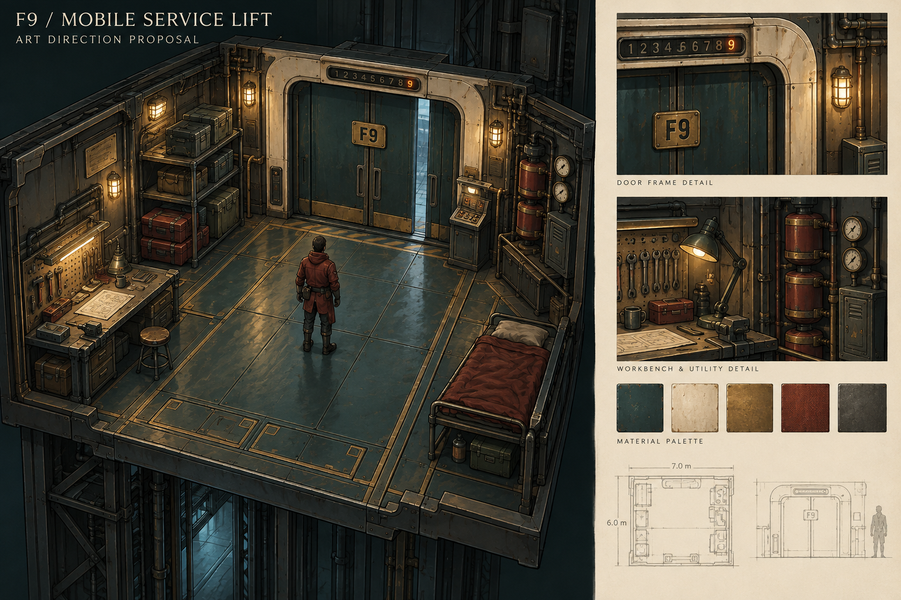

# F9 电梯美术重构方案：移动维修营地

日期：2026-09-26。状态：**设计提案，待讨论；本轮不替换游戏中的电梯**。

后续进展（同日）：用户已授权开始美术迭代并确认与房间同风格，首版已接入 `/survival`。下面保留原提案；实际尺寸、镜头、设施与功能边界见[实装记录](../design-log/iterations/F9/2026-09-26-survival-service-lift.md)。

概念图使用内置 image_gen 生成，用于讨论空间、气氛与材质；不是实机截图。落地时会收敛成当前游戏的手绘块面、墨色轮廓和实时灯光。[完整提示词与生成方式](./F9_ELEVATOR_REBUILD_2026-09-26.prompt.txt)。

## 1. 推荐方向

**一台被幸存者逐步改造成家的旧工业货梯。** 保留旧设定的床、桌面、金属操作台和屏幕，延续现在水处理站的机械语言。让玩家一眼认出这是同一世界里最熟悉的空间，并能迅速找到出发、收纳和准备的位置。

美术重点放在三个层次：门框与楼层指示器建立身份；沿墙设施表达生存用途；暖灯、红色毯子和几件常用工具留下生活痕迹。中央地面留白，避免在回收物资时找不到角色和出口。

## 2. 空间布局

建议从约 **6×7 米**的内舱白盒起步，尺寸暂定；当前战斗地图中的电梯口仍是现有规格。重构时先验证角色比例、可走区域和设施交互，再确定最终舱体尺寸。

| 位置 | 主要物件 | 玩家用途与视觉处理 |
| --- | --- | --- |
| 远端中央 | 双扇机械门、象牙色圆角门框、F9 铭牌、楼层指示器 | 主要视觉中心与出发方向；指示器使用大数字，门缝冷光可识别 |
| 门右侧 | 倾斜式调度屏、实体按钮、小型通讯器 | 楼层选择和出勤信息；屏幕嵌进物体，靠近才显示交互标签 |
| 左侧靠门 | 货架、可堆叠运输箱、独立小型保管匣 | 回收物资、仓储入口；与场内可翻找容器有相同结构语言，靠标记和状态区分用途 |
| 左侧近端 | 金属工作台、工具挂板、任务灯、记录桌面 | 装备整理／维护入口；保留桌面与金属台设定，只有一个醒目的工作面 |
| 右侧近端 | 折叠床、暗红毯子、床下水罐 | 休息区与生活气息；轮廓低，避免遮住角色 |
| 右侧靠门 | 封闭动力箱、压力表、储液筒 | 呈现电梯仍在工作；暂作为环境反馈，后续是否开放建造／生产另行决定 |
| 中央 | 两米左右的通行带、简洁检修地板 | 角色停留、转身、出发的清晰空间；收纳物品不挤占主通道 |

这些位置服务于同一条动线：**门口进入 → 货架卸货 → 工作台准备 → 调度屏出发**。休息区放在另一侧，使玩家容易记住每个角落的用途。设施大件优先，第一版只保留少量可辨识的小道具。

## 3. 美术语言

- **造型**：厚重圆角门框、折弯钢板、铆钉、机械门缝、内嵌表盘。将大轮廓做好，再加入必要的接缝和磨损。
- **主色**：深青绿烤漆约 60%，象牙色面板约 25%，暗红织物／警示漆和暗金五金约 15%；比例为视觉建议。
- **材质**：延续当前分段明暗和手绘表面。磨损集中在把手、门槛、桌沿，墙面和地面保留安静的大色块。
- **灯光**：门外偏冷，舱内暖白；工作台有局部任务灯，楼层指示器为少量琥珀发光。灯光从中心向边缘降低，确保角色和主要交互点清楚。
- **镜头**：继续使用当前俯斜正交视角。舱顶和靠镜头一侧墙体采用剖切／淡出；床和工作台保持低矮，不强迫切换为第一人称。
- **动态**：门锁松开、指示器切换、轻微机械震动和缓慢压力表反馈。避免全场闪灯和持续大幅晃动。

## 4. 门和交互状态

| 状态 | 美术表达 | 本方案的规则边界 |
| --- | --- | --- |
| 停靠／准备 | 门框暖灯稳定，屏幕可读，设施有局部灯光 | 基地具体功能沿用已存在设定，新增功能需另定规则 |
| 开门／出勤 | 指示器确认楼层，门缝冷光扩大，门扇平移 | 开门动画与可通行碰撞同步 |
| 战斗区域返程 | 入口的暖灯可从房间辨认，舱内清楚可见 | 保留当前撤离读条；进入门口不自动无敌或补满 |
| 撤离读条 | 门边进度灯收拢，角色周围保持可读 | 移动或受伤仍可打断；不可提前把门完全关上遮住来袭者 |
| 撤离成功 | 门扇闭合、冷光消失、再切到舱内准备状态 | 只有结算成功后才表现安全；跨局保存仍需单独实现 |

常驻设施以物体为入口，标签在靠近、悬停或键盘聚焦时出现。标签使用本轮统一的逐帧投影方案，避免随着镜头移动跳动。主动作始终只有一个明确入口，其余功能放在各自物件上。

## 5. 制作拆分与复用

1. **白盒与镜头**：舱体、门、四组设施的占地；用当前角色测试进出、转身、遮挡和点击可达。
2. **核心美术**：先完成门框、门扇、楼层牌、地板、墙板与主光。用实际战斗镜头验收一次，再增加小件。
3. **生活与工作设施**：工作台、床、货架、调度台、动力箱；复用已有柜门、箱盖、管道和表盘部件。
4. **状态反馈**：开关门、停靠指示、撤离灯、交互高亮；验证动画不提前改变碰撞或撤离结果。

模块数量与材质控制在可复用范围。概念图中的细密笔触不逐根建模，使用少量共享纹理与程序表面处理表达；光源以一组主光和少量局部光为主。当前路线优先做一个稳定舱体，设施扩建只预留接口。

## 6. 下一轮验收标准

- 在实际游戏镜头中能一眼找到门、角色、工作台、货架和休息区。
- 中央通行带畅通；视线剖切和碰撞不产生“看似能走却撞墙”。
- 与水处理站保持同一美术风格，同时用暖光和生活物件表现回家感。
- 出发、返程、撤离成功三种状态能从画面区分，表现与结算同步。
- 保持当前桌面窗口下的信息可读性；以实机场景测试性能，不把概念图视为性能承诺。

**建议下一步**：先做“舱体＋门＋主灯”的可走白盒和基础美术，确认比例、镜头和温暖感，再加入功能设施。概念图的布局与比例均可在讨论后调整。
